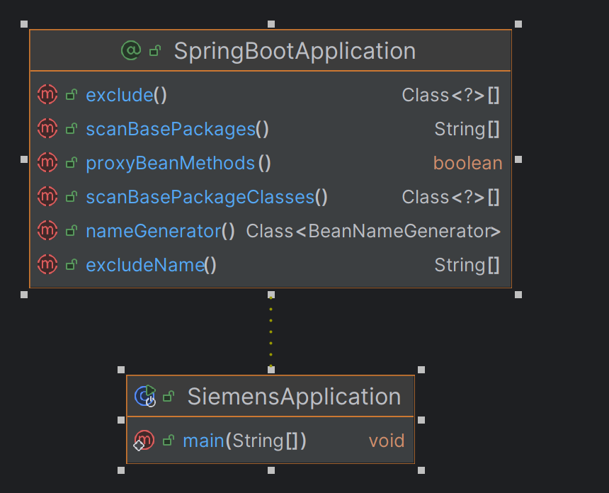
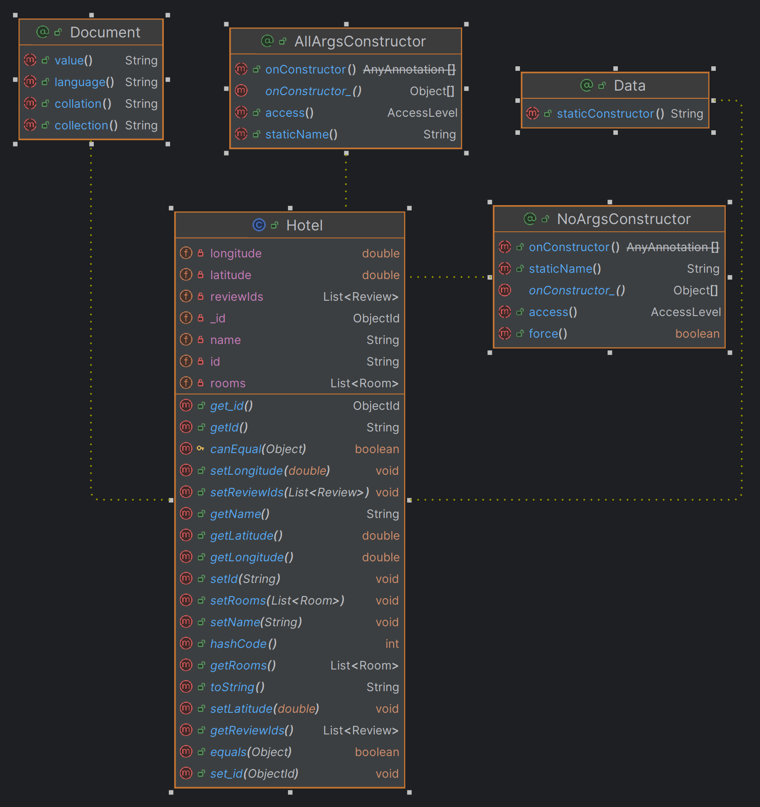
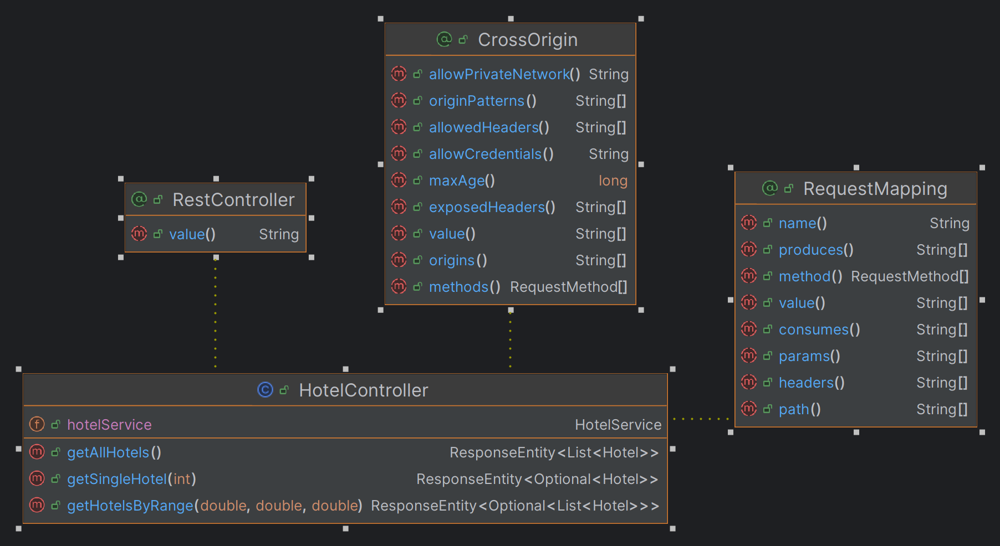
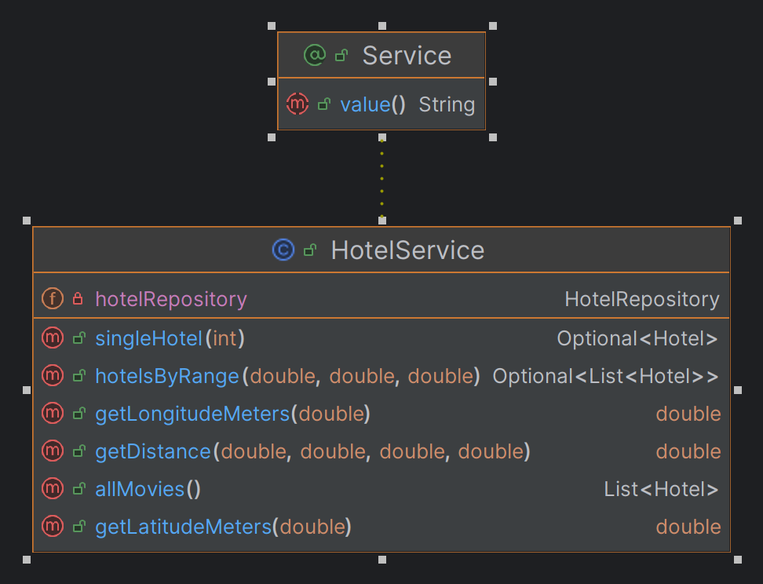
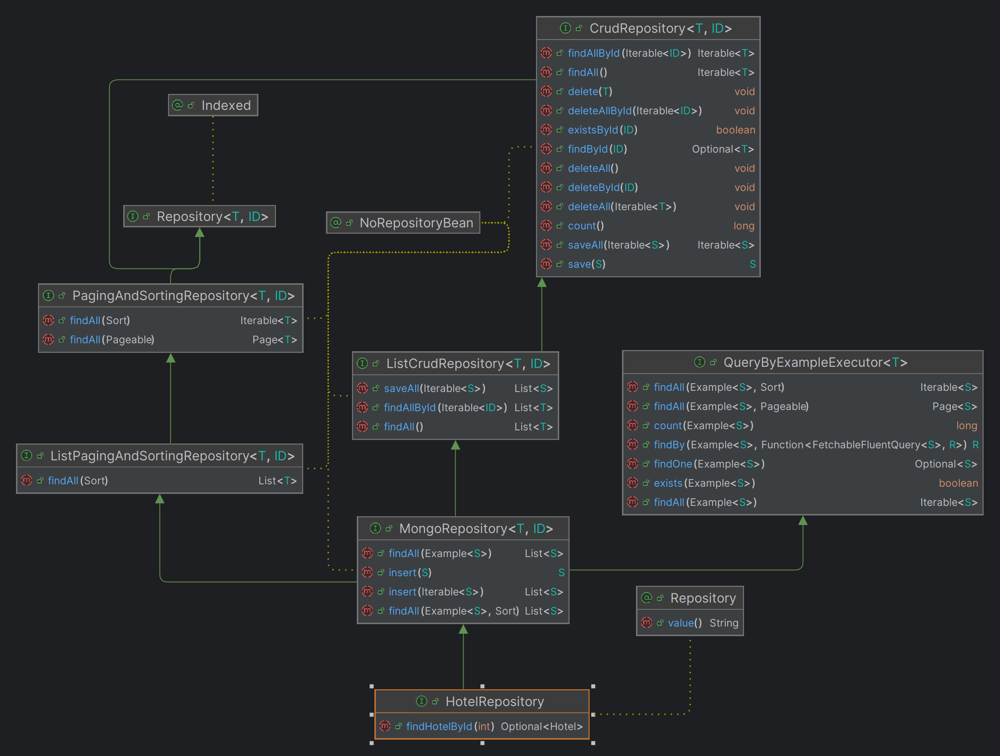
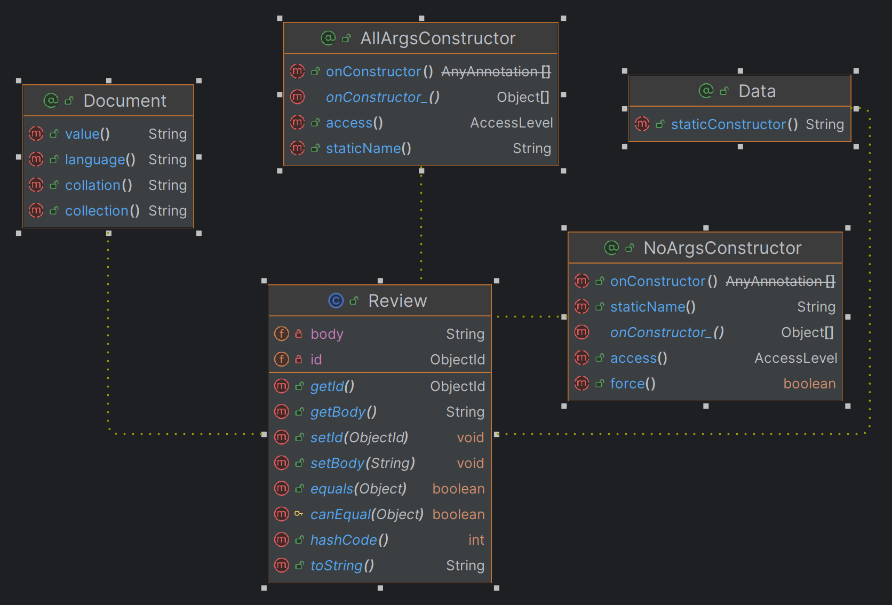
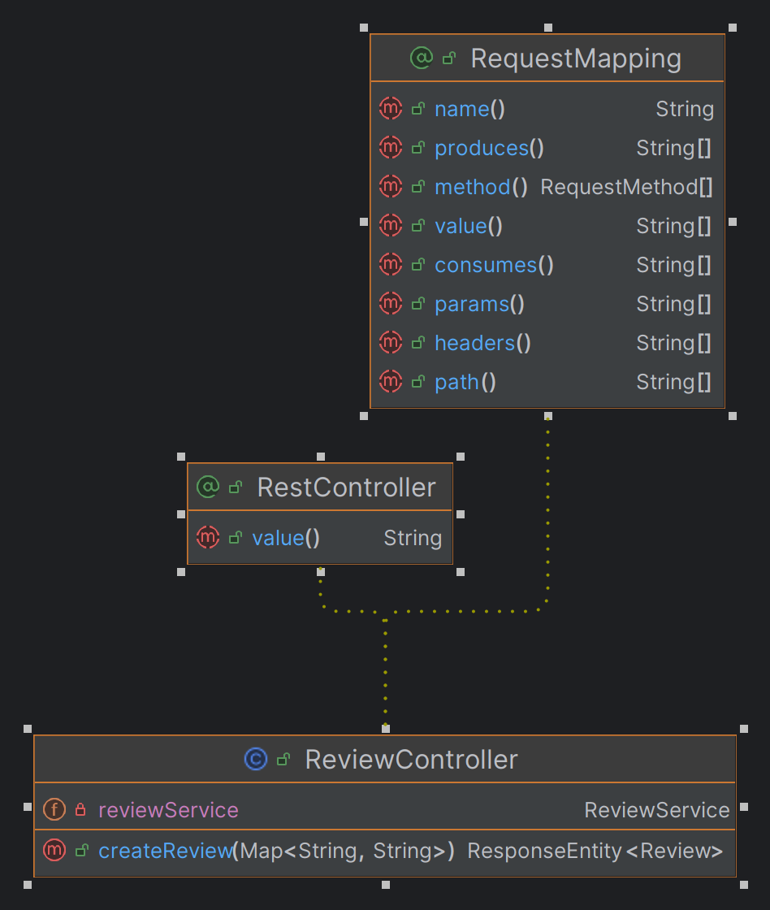
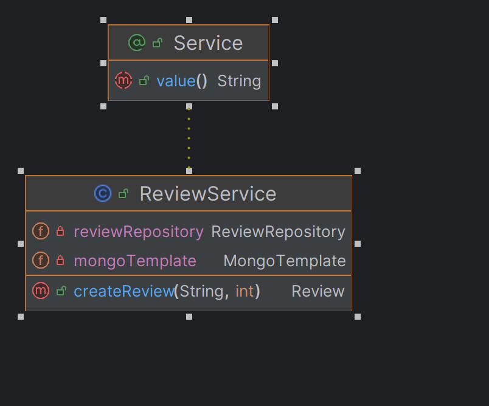
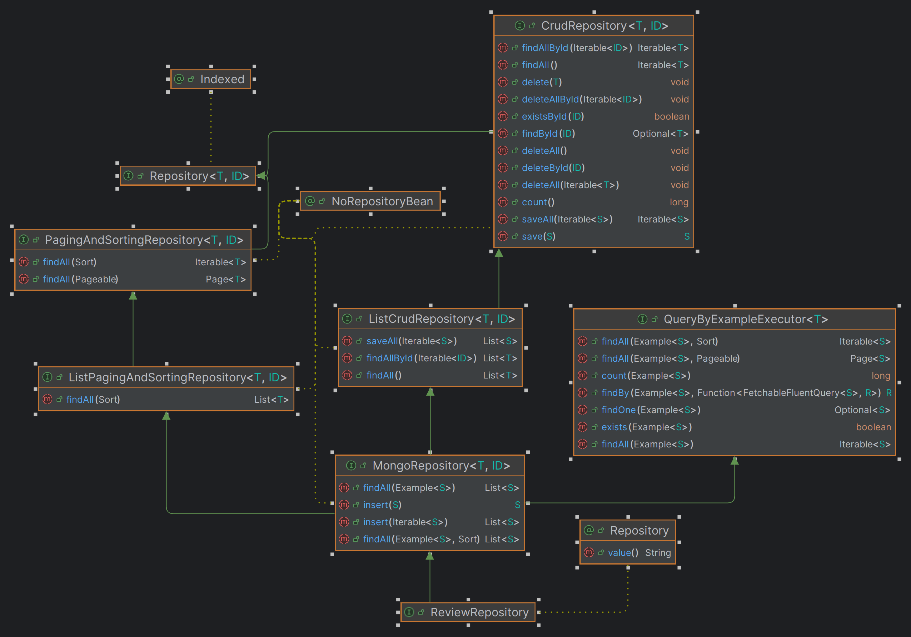
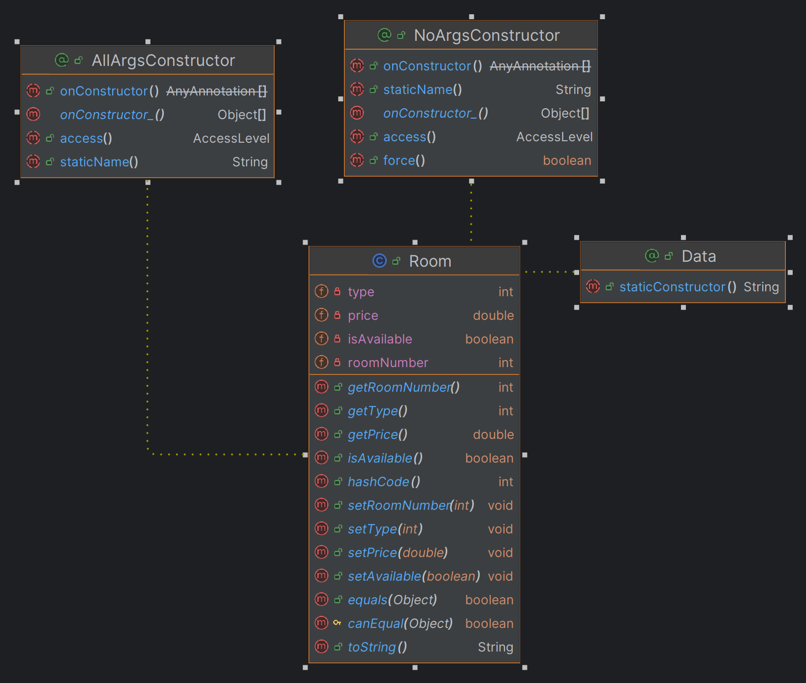

# Siemens problem :)

This is my approach for the  **Siemens problem**. I did not manage to complete all the tasks, but there are the ones that I managed to complete.
In order to use the app, you can start the server side using IntelliJ IDEA, for the frontend you can use npm start.
I was able to:

 - [x] Get the user's coordinate in latitude and longitude using geolocation
 - [x] Compute the user's coordinates into meters
 - [x] Compute the hotel's coordinates into meters
 - [x] Compute the distance using the 2 points formula
 - [x] Filter the hotels which are within that radius in order to show them to the user
 - [x] The user can se how many rooms does every hotel have
 - [x] The user can leave a feedback for the hotel

 ## Technology stack

>For the back-end side I've used **Java Spring Boot** and **axios** for API management in React. 
>In order to test that everything is on point and every API works fine I've used **Insomnia**. 
>When talking about front-end I've used **React**
and **Tailwind CSS**. 
>Due to the json file model that I've got, I used **MongoDB** as database manager.

# Uncompleted tasks

I did not manage to complete the entire app, I did not implement the CRUD functionalities for the user on every hotel, so the user for now isn't able to book a room and change or cancel the booking two hours earlier than the check-in.
It is no big deal, I would have created another APIs to insert the bookings in the database, one to show only the available spots, one to cancel the booking if the condition is fulfilled and one to update the booking details only if the condition is fulfilled.

# Diagrams

